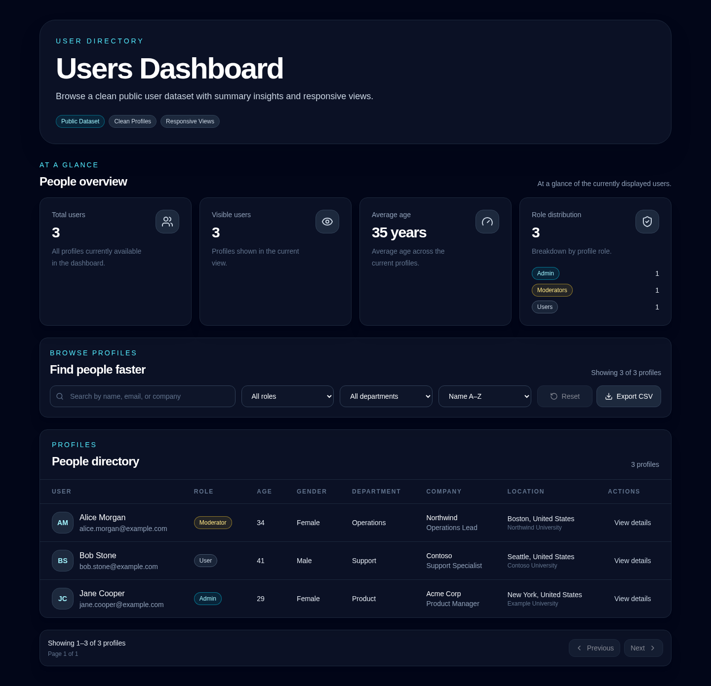
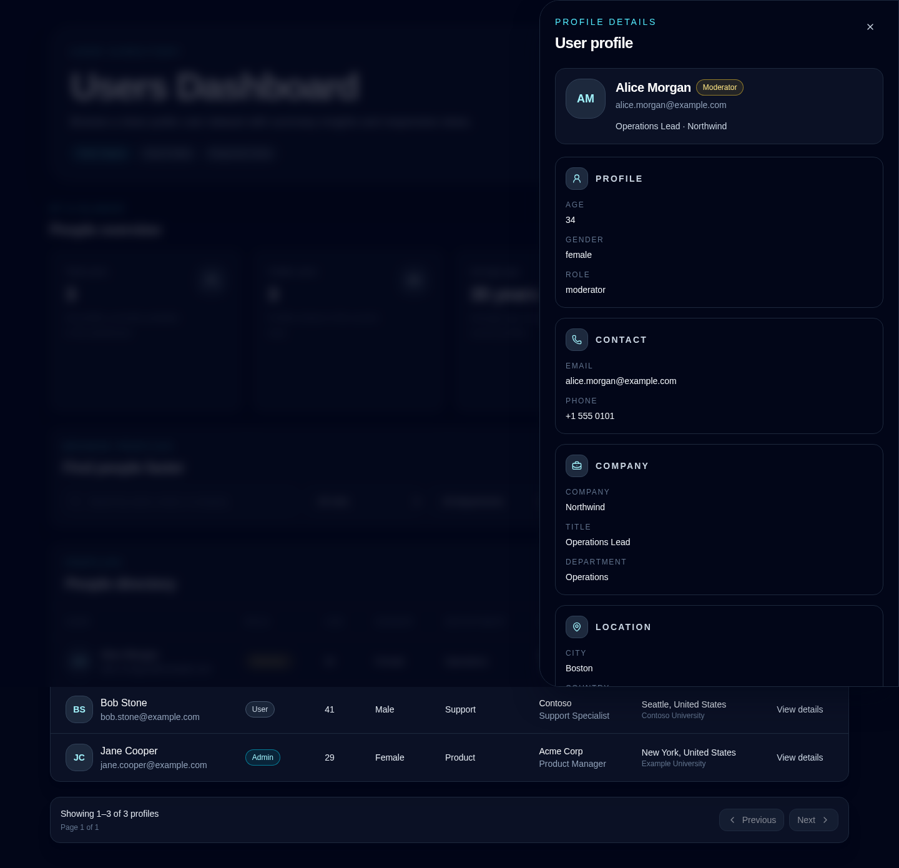

# Users Dashboard

- [English](#english)
- [Русский](#русский)

## English

### Overview

Users Dashboard is a test assignment project with an interactive user dashboard.

The app loads public DummyJSON users, normalizes them into a safe `User` model, and shows them with summary metrics, search, filters, sorting, pagination, user details, responsive views, and CSV export.

### Features

- Users dashboard page
- Summary metrics
- Search by user and company fields
- Role and department filters
- Sorting and pagination
- Desktop users table
- Mobile user cards
- User details drawer
- CSV export for the current filtered user result set
- Loading, error, empty, and no-results states
- Unit, component, and smoke tests

### Why this approach

I used Next.js, React, and TypeScript because they fit a dashboard task well: the UI stays component-based, typed, and easy to verify.

The project is split into small feature modules so the main dashboard parts can be reviewed and changed independently. Raw DummyJSON data is validated and mapped into a safe `User` model before it reaches the UI.

Search, filters, sorting, and pagination are stored in the URL query string. This makes the current dashboard view shareable without adding unnecessary global state.

CSV generation and file download are separated: CSV formatting is pure and tested, while browser-only download logic is isolated.

An architecture note is available in [ADR 001](docs/adr/001-user-dashboard-architecture.md).

### Tech stack

- Next.js App Router
- React
- TypeScript
- Tailwind CSS
- Zod
- Vitest
- React Testing Library
- Playwright
- DummyJSON public API

### Getting started

```bash
npm ci
cp .env.example .env.local
npm run dev
```

### Environment

```env
NEXT_PUBLIC_DUMMYJSON_BASE_URL="https://dummyjson.com"
```

### Verification

```bash
npm run typecheck
npm run lint
npm run test
npm run build
npm run test:e2e
```

For local Playwright runs, install the browser:

```bash
npx playwright install chromium
```

### Screenshots





### Note

Deployment is not required for this test assignment. The project can be reviewed and run locally.

---

## Русский

### Обзор

Users Dashboard — тестовое задание с интерактивным дашбордом пользователей.

Приложение загружает публичных пользователей из DummyJSON, приводит данные к безопасной модели `User` и отображает их со статистикой, поиском, фильтрами, сортировкой, пагинацией, деталями пользователя, адаптивными представлениями и CSV-экспортом.

### Возможности

- Страница дашборда пользователей
- Карточки статистики
- Поиск по пользователю и данным компании
- Фильтры по роли и отделу
- Сортировка и пагинация
- Таблица пользователей для desktop
- Карточки пользователей для mobile
- Drawer с деталями пользователя
- CSV-экспорт текущей отфильтрованной выборки пользователей
- Состояния загрузки, ошибки, пустого списка и отсутствия результатов
- Unit, component и smoke-тесты

### Почему такой подход

Я использовал Next.js, React и TypeScript, потому что они хорошо подходят для dashboard-интерфейса: UI остаётся компонентным, типизированным и удобным для проверки.

Проект разделён на небольшие feature-модули, чтобы основные части дашборда можно было независимо смотреть на ревью и безопасно менять. Raw-данные DummyJSON сначала валидируются и приводятся к безопасной модели `User`, и только потом попадают в UI.

Состояние поиска, фильтров, сортировки и пагинации хранится в URL query string. Так текущий вид дашборда можно воспроизвести по ссылке без лишнего глобального хранилища состояния.

CSV-генерация и скачивание файла разделены: формирование CSV — чистый протестированный helper, а browser-only логика скачивания изолирована отдельно.

Архитектурное решение описано в [ADR 001](docs/adr/001-user-dashboard-architecture.md).

### Стек

- Next.js App Router
- React
- TypeScript
- Tailwind CSS
- Zod
- Vitest
- React Testing Library
- Playwright
- Публичный API DummyJSON

### Запуск

```bash
npm ci
cp .env.example .env.local
npm run dev
```

### Переменные окружения

```env
NEXT_PUBLIC_DUMMYJSON_BASE_URL="https://dummyjson.com"
```

### Проверка

```bash
npm run typecheck
npm run lint
npm run test
npm run build
npm run test:e2e
```

Для локального запуска Playwright установите браузер:

```bash
npx playwright install chromium
```

### Скриншоты


### Примечание

Деплой для тестового задания не обязателен. Проект можно проверить локально.
